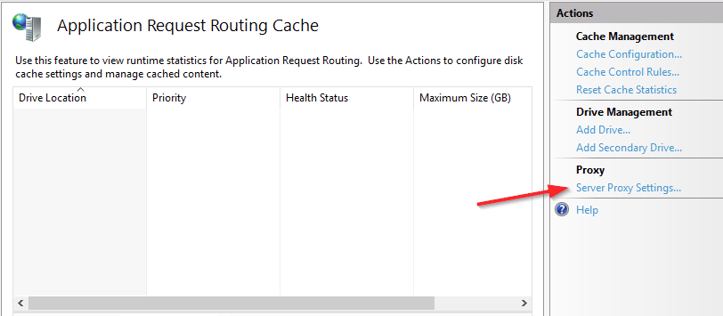
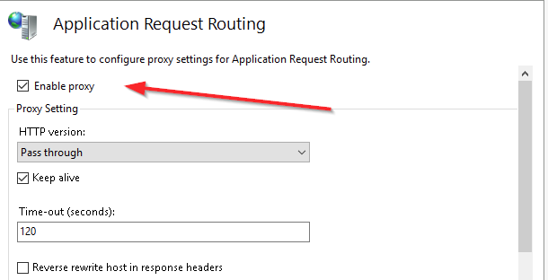
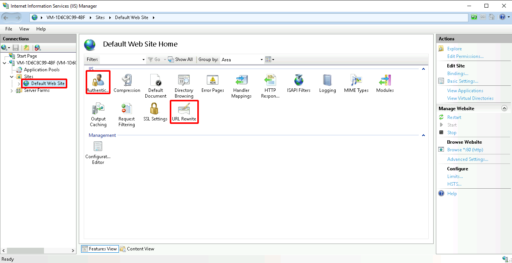
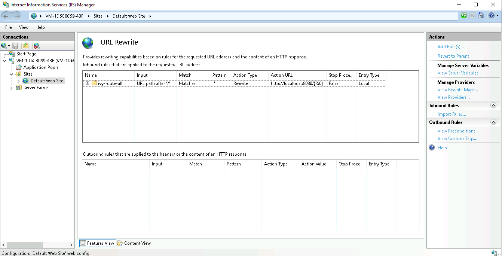
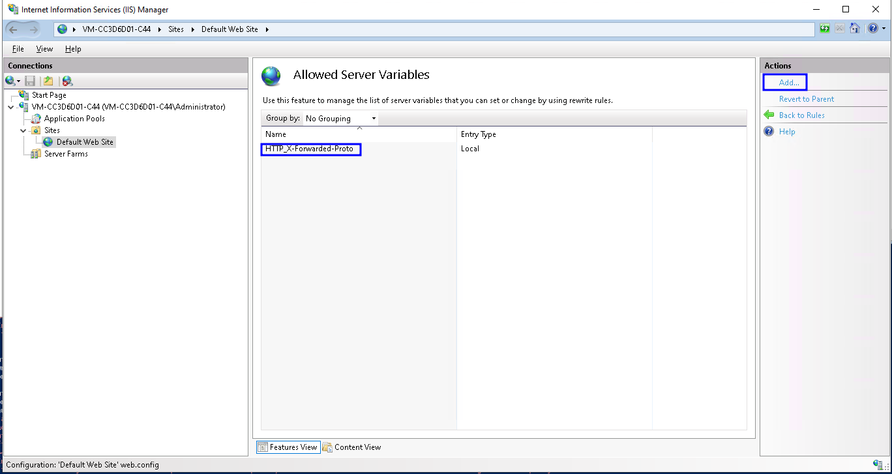
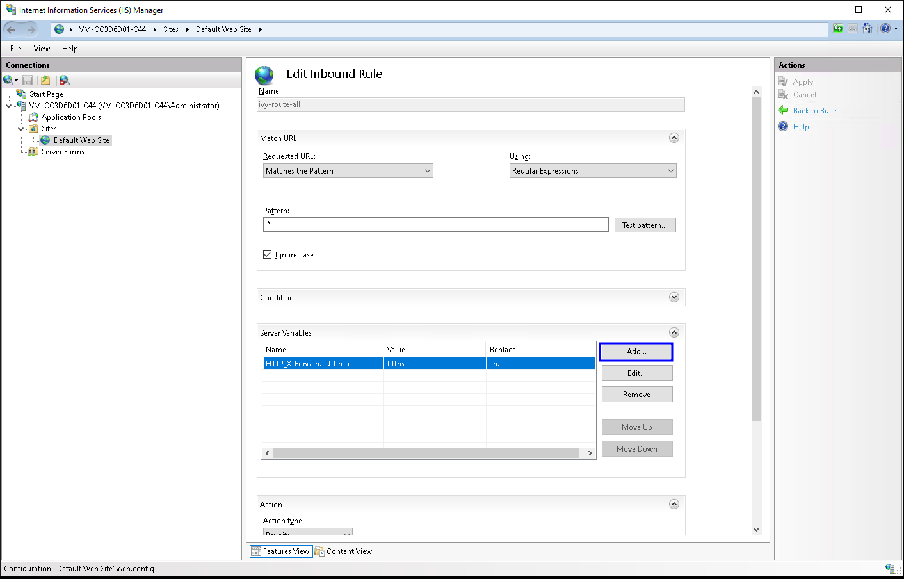
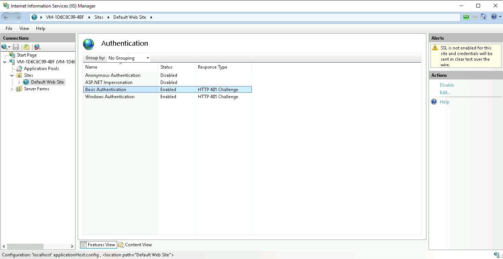
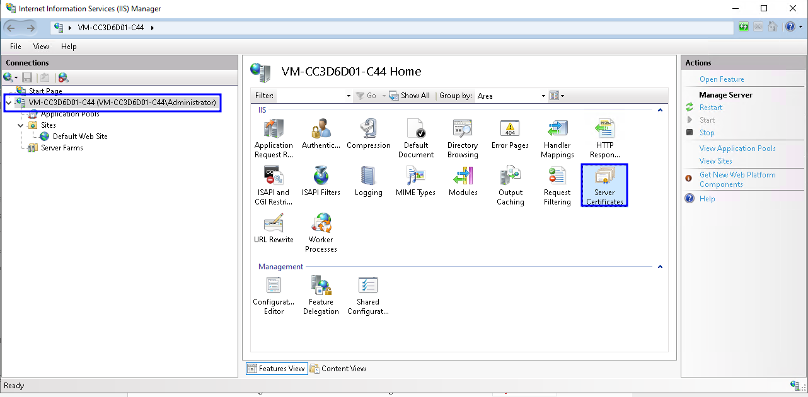
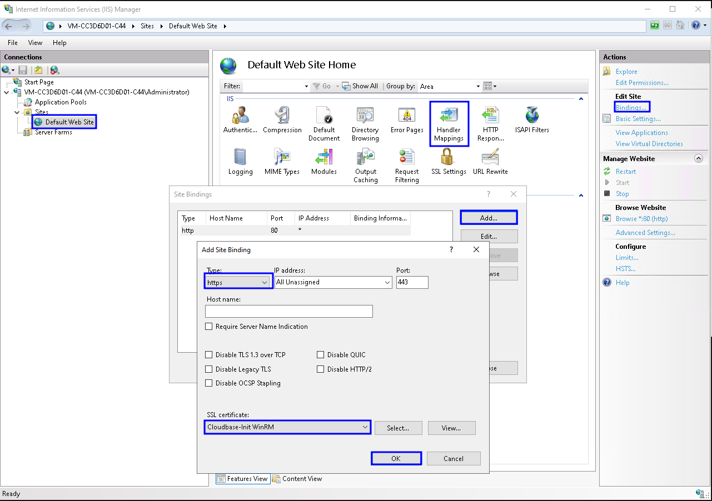

# Manual installation

In case the automated script doesn't work for you. 
Here's what the script does and must be done manually:

## Basic IIS Setup 🌐️

Install all required features including IIS itself, as well
as the URL Rewrite and Application Request Routing (ARR) modules. Furthermore,
it will enable the reverse proxy capabilities.

And set `preserveHostHeader` to `true`. The most important
configuration entries in IIS are the `Authentication` and
`URL Rewrite` modules. The script will sense if IIS including all
required features is already installed and will skip the IIS installation in
that case. 

  
## URL Rewrite Rules 🚦️

Configure the rules for URL rewriting. It will add a
new rule `ivy-route-all` to the `Default Website`. This will
route all traffic to the Axon Ivy Engine which runs on the same host at
`http://localhost:8080`. You may adjust this rule according to your
needs when your Axon Ivy Engine runs on a different host, and/or on a different
port. We recommend to limit the access [Path] to
specific applications by only routing the applications that are available to
your users. You can do that by changing the standard pattern `.*` of the
rule to `YOUR-APP.*` e.g., `demo-portal.*`. e.g.,
`system.*`. If you have multiple apps being served by this IIS site, use
a rule like `(demo-portal|myApp1|myOtherApp)\/.*`. We suggest that you
define a separate, internal-only website for access to the engine cockpit.

There are features in Axon Ivy that require WebSocket communication. Therefore,
we automatically install the WebSocket feature. IIS-ARR is not able to
negotiate WebSocket compression, therefore we need to always set the HTTP
header `SEC_WEBSOCKET_EXTENSIONS` to empty. We implement that adding
`HTTP_SEC_WEBSOCKET_EXTENSIONS` to `IIS Server Variables` and
setting `HTTP_SEC_WEBSOCKET_EXTENSIONS` on the `ivy-route-all`
rewrite rule to empty.

## Terminate SSL on IIS 🔚️

Ensure that IIS serves the Axon Ivy Engine over HTTPS
but the connection between IIS and Axon Ivy Engine is HTTP only. 
We highly recommend to [Terminate SSL].
This will create a new `IIS Server Variable` called
`HTTP_X-Forwarded-Proto` that will be set to `https` on the
`ivy-route-all` rewrite rule. This will send the HTTP header
`X-Forwarded-Proto` from IIS to the Axon Ivy Engine. The Axon Ivy Engine needs
this information to generate correct URLs.

## Setup SSO 🪪️

Configure [Single Sign-on]. This will
enable Windows Authentication and will add a HTTP request header
`X-Forwarded-User` with the current user to the request that will be
forwarded to the Axon Ivy Engine. You will also need to activate [Single Sign-on]
 on the Axon Ivy Engine in `ivy.yaml`. The script will also
enable Basic Authentication which is required for REST clients like the
Axon Ivy Mobile App to call the protected REST Services provided by the
Axon Ivy Engine. If you don't need this you can manually disable it.

> [!WARNING]  
> If you enable SSO, you need to make sure that your users can access the
Axon Ivy Engine exclusively via IIS [Single Sign-on].

# Serve with HTTPS
Is not covered by this script. You need to set this up
manually. You need to install an SSL certificate 🔐️. You can do this on the server
level in section `Server Certificate`. Import your SSL certificate
there. Alternatively, you can generate a self-signed certificate to try out
HTTPS.  

Then, go to `Default Website`, open `Handler Mappings` and
add `https` as a new binding. Choose the SSL certificate you supplied
earlier. We strongly recommend to remove the `http` binding. This prevents your
Axon Ivy Engine being accessible via HTTP through IIS.

[Single Sign-on]: https://developer.axonivy.com/doc/dev/en/engine-guide/integration/single-sign-on/index.html

[Path]: https://developer.axonivy.com/doc/dev/en/engine-guide/integration/reverse-proxy/secure-setup/path.html

[Terminate SSL]: https://developer.axonivy.com/doc/dev/en/engine-guide/integration/reverse-proxy/secure-setup/protocol.html#reverse-proxy-terminate-ssl
